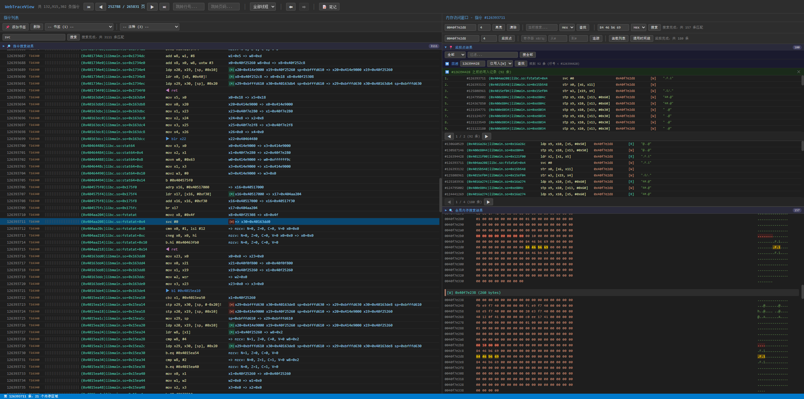

# WebTraceView

基于 Web 的 unidbg 指令级 trace 分析工具。将 unidbg 执行过程中的每条 ARM 指令、寄存器状态、内存读写数据记录为二进制文件，通过本地 Web 服务进行可视化浏览和分析。



## 功能

- **指令浏览** — 分页加载 trace 中的 ARM 指令，显示 PC 地址（含 SO 名+偏移）、汇编文本、寄存器读写状态、调用深度，支持跳转到任意行号
- **内存读写查看** — 点击任意指令可查看该指令执行时的内存读写数据，以 hex dump + ASCII 形式展示，实际访问区域高亮
- **多线程支持** — 记录每条指令所属的 unidbg 模拟线程 ID，支持按线程过滤指令列表，预建 per-thread 索引保证过滤速度
- **SVC 指令写入支持** — 对 SVC 指令（系统调用）期间发生的内存写入进行捕获，需要在 backend 中加入 `RegAccessPrinter.onMemWrite(address, size)` 调用
- **内存搜索** — 在所有指令的内存读写数据中搜索 hex 字节序列或字符串，定位特定数据（密钥、明文、魔数等）出现在哪些指令中
- **内存监控点 (Watchpoint)** — 设置监控地址范围，找出所有访问过该地址的指令（读/写），支持按类型过滤
- **Watchpoint 回溯** — 从指定行号向前回溯，找到最近一次写入（或读取）监控地址的指令，用于追踪数据来源链
- **指令搜索** — 按关键词搜索指令文本、PC 地址、寄存器状态，支持多关键词（空格分隔，取交集）
- **寄存器追踪** — 追踪指定寄存器在指定行号范围内的值变化，只显示被写回修改的记录
- **函数识别** — 通过 BL/BLR/RET 指令自动识别函数入口，统计调用次数、首次调用行号
- **函数调用时间线** — 以树形结构展示函数调用流程，显示调用深度、起止行号，支持按线程过滤
- **多核并行搜索** — 所有搜索操作（内存搜索、指令搜索、Watchpoint、寄存器追踪）根据 CPU 核数自动分段并行处理
- **书签与注释** — 对任意指令添加书签或注释，右键菜单操作
- **会话持久化** — 书签、注释、笔记、搜索状态等保存到 `.session.json` 文件，重新打开时自动恢复
- **MCP 支持** — 内置 MCP (Model Context Protocol) 端点（`/mcp`），提供 `trace_info`、`get_instructions`、`get_memory`、`search_memory`、`set_watchpoint`、`watchpoint_traceback` 等工具，可供 AI 辅助分析

## 使用方法

### 1. 准备 trace 数据

将 `RegAccessPrinter.java` 复制到 unidbg 项目的 `src/main/java/com/github/unidbg/` 目录下。

在你的 unidbg 代码中，执行目标函数前后添加：

```java
// 开始 trace，输出到 trace_output.bin
RegAccessPrinter.initTraceFile(emulator, "trace_output.bin");

// ... 执行目标函数 ...

// 结束 trace，刷写缓冲区
RegAccessPrinter.shutdownTrace();
```

如需捕获 SVC 期间的内存写入，需要在 backend 的写入回调中添加：

```java
RegAccessPrinter.onMemWrite(address, bytes.length);
```

### 2. 启动 WebTraceView

```bash
# 直接运行（默认读取当前目录下的 trace_output.bin）
go run .

# 指定 trace 文件路径
go run . /path/to/trace_output.bin
```

启动后访问 `http://localhost:8080` 查看分析界面。

MCP 端点地址为 `http://localhost:8080/mcp`，可在支持 MCP 的 AI 工具中配置使用。

### 3. 界面操作

- 左侧面板为指令列表，点击任意指令查看右侧的内存读写数据
- 顶栏可输入行号跳转、按线程过滤
- 右键指令行可添加书签、注释，或复制 PC / 指令信息
- 右侧面板包含内存搜索、Watchpoint、寄存器追踪、全局内存搜索等功能区
- 底部可展开函数调用时间线

## 二进制格式

每条记录的格式（小端序）：

| 字段 | 大小 | 说明 |
|------|------|------|
| magic | 4B | 固定 `"UTRA"` |
| threadId | 4B | 线程 ID |
| pc | 8B | 指令地址 |
| pcTextLen | 2B | PC 文本长度 |
| pcText | N B | PC 符号化文本，如 `libc.so+0x1a3b4` |
| instrLen | 2B | 汇编文本长度 |
| instrText | N B | 汇编文本 |
| regTextLen | 2B | 寄存器文本长度 |
| regText | N B | 寄存器状态，格式 `x0=0x1 x1=0x2 => x0=0x3` |
| readChunkCnt | 4B | 读内存块数量 |
| readChunks | ... | `[base:8B, len:4B, data:lenB]` x N |
| writeChunkCnt | 4B | 写内存块数量 |
| writeChunks | ... | `[base:8B, len:4B, data:lenB]` x N |

每个内存块捕获实际访问地址前后各 128 字节的上下文窗口。
